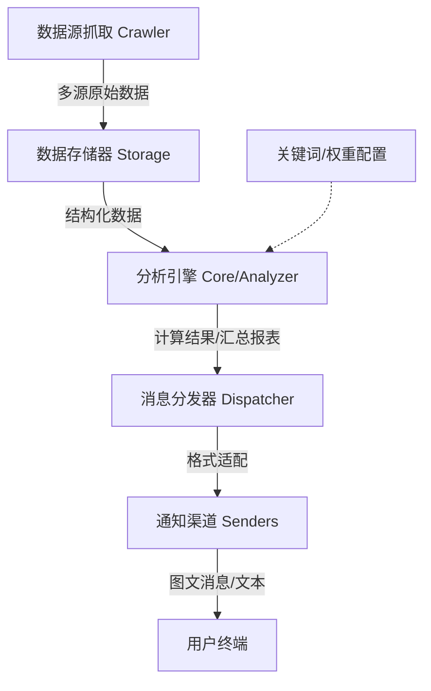

# 技术架构文档 (Architecture)

本文档旨在介绍 TrendRadar (MisonL 二开版) 的技术架构、设计原理及核心工作流。

## 1. 核心工作流

TrendRadar 采用经典的 **管道-过滤器 (Pipe-and-Filter)** 架构模型。整个数据流转过程如下：

## 2. 模块化设计

### 2.1 爬虫层 (Crawler)

- **多平台适配**：通过适配器模式支持华尔街见闻、财联社、知乎等热点平台。
- **RSS 支持**：内置 RSS/Atom 抓取引擎，支持通用订阅源。
- **调度机制**：基于 Cron 或直接运行模式。

### 2.2 存储层 (Storage)

- **多后端抽象**：通过 `StorageManager` 统一管理。
- **SQLite**：默认本地存储，适合 Docker 及个人部署，提供高性能查询。
- **S3 兼容**：支持 Cloudflare R2、阿里云 OSS 等远程同步。

### 2.3 核心分析层 (Core)

- **智能汇总**：负责对海量新闻进行去重、清洗。
- **热度算法**：公式 `Score = (Rank * W1) + (Frequency * W2) + (Hotness * W3)`。
- **频率过滤**：通过 `frequency_words.txt` 进行关键词匹配与正则扫描。

### 2.4 通知层 (Notification)

- **Dispatcher**：负责多渠道批量分发任务。
- **Sender 适配器**：
  - 企业微信：支持 `textcard` 与 `news` (图文列表) 深度优化。
  - Markdown 渲染：自动转换 HTML/Markdown 以适配各端。
- **分批处理**：自动应对大厂 API 的消息长度限制。

## 3. 技术栈 (Tech Stack)

- **语言**：Python 3.10+
- **环境隔离**：Docker & Docker Compose
- **核心依赖**：
  - `requests` / `httpx`: 网络请求
  - `PyYAML`: 配置解析
  - `SQLite`: 数据引擎
  - `Jinja2`: HTML 报告模板生成

## 4. 特色功能 (MisonL Fork)

- **财经深度聚焦**：针对 A 股盘面异动与机会捕捉优化了匹配逻辑。
- **视觉复刻**：针对企业微信定制了极具“公众号感”的图文列表推送，并支持局域网 IP 直连访问。
