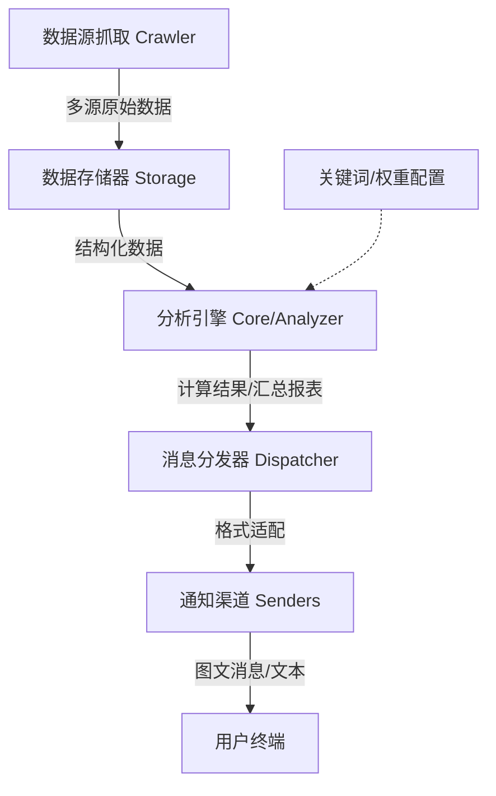

# 技术架构文档 (Architecture)

本文档旨在介绍 TrendRadar (MisonL 二开版) 的技术架构、设计原理及核心工作流。

## 1. 核心工作流

TrendRadar 采用经典的 **管道-过滤器 (Pipe-and-Filter)** 架构模型。整个数据流转过程如下：



## 2. 项目结构

```
TrendRadar/
├── src/                    # 源代码
│   ├── trendradar/         # 主应用
│   │   ├── core/           # 核心分析逻辑
│   │   ├── crawler/        # 热榜/RSS 爬虫
│   │   ├── notification/   # 多渠道推送
│   │   ├── storage/        # 存储层 (SQLite/DuckDB/S3)
│   │   └── utils/          # 工具函数
│   └── mcp_server/         # MCP 服务端
├── config/                 # 配置文件
├── docker/                 # Docker 部署
├── docs/                   # 文档
├── scripts/                # 辅助脚本
└── tests/                  # 单元测试
```

## 3. 模块化设计

### 3.1 爬虫层 (Crawler)

- **多平台适配**：通过适配器模式支持华尔街见闻、财联社、知乎等热点平台。
- **RSS 支持**：内置 RSS/Atom 抓取引擎，支持通用订阅源。
- **异步架构**：基于 `httpx` + `asyncio` 实现高并发抓取。
- **图片补充**：自动提取文章 `og:image` 或正文首图，无图时使用占位图。

### 3.2 存储层 (Storage)

- **多后端抽象**：通过 `StorageManager` 统一管理。
- **SQLite**：每日新闻数据存储，支持增量更新。
- **DuckDB**：高性能分析引擎，用于历史数据聚合。
- **S3 兼容**：支持 Cloudflare R2、阿里云 OSS 等远程同步。

### 3.3 核心分析层 (Core)

- **智能汇总**：负责对海量新闻进行去重、清洗。
- **热度算法**：公式 `Score = (Rank * W1) + (Frequency * W2) + (Hotness * W3)`。
- **频率过滤**：通过 `config/frequency_words.txt` 配置关注的关键词和话题。

### 3.4 通知层 (Notification)

- **Dispatcher**：负责多渠道批量分发任务。
- **Sender 适配器**：企业微信、飞书、钉钉、Telegram、Email、Slack 等。
- **图片占位**：当文章无图时，自动使用默认 Banner 图。
- **分批处理**：自动应对大厂 API 的消息长度限制。

## 4. 技术栈 (Tech Stack)

- **语言**：Python 3.10+
- **包管理**：`uv` (pyproject.toml)
- **网络请求**：`httpx` (异步)
- **数据存储**：SQLite + DuckDB
- **容器化**：Docker & Docker Compose
- **配置解析**：PyYAML
- **HTML 报告**：Jinja2

## 5. 特色功能 (MisonL Fork)

- **灵活配置**：通过 `config/frequency_words.txt` 自定义关注任意领域。
- **视觉复刻**：企业微信定制"公众号感"图文列表推送。
- **MCP 支持**：可接入 Cherry Studio 等客户端进行深度舆情问答。
